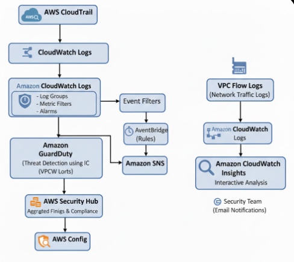
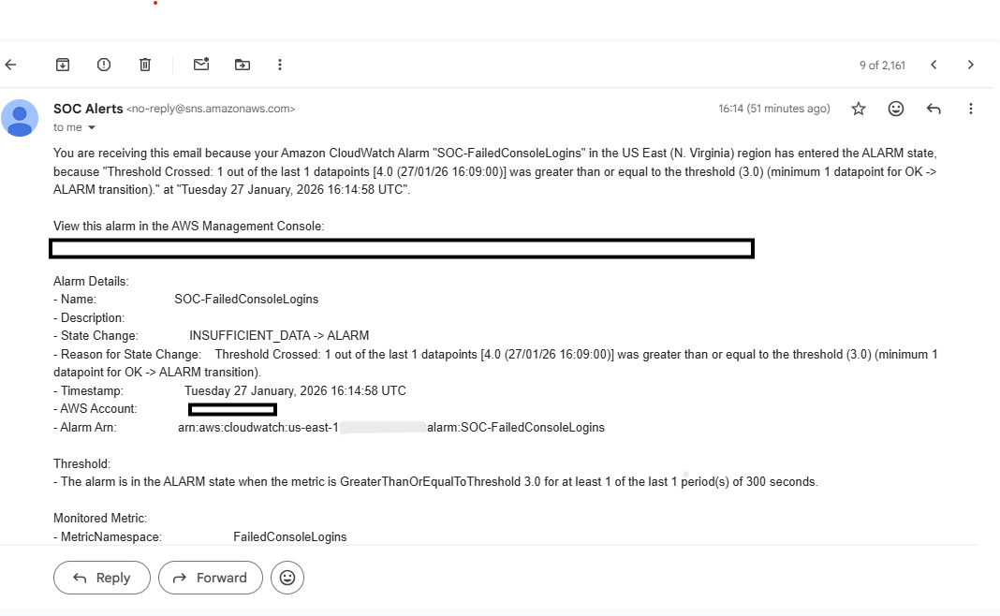
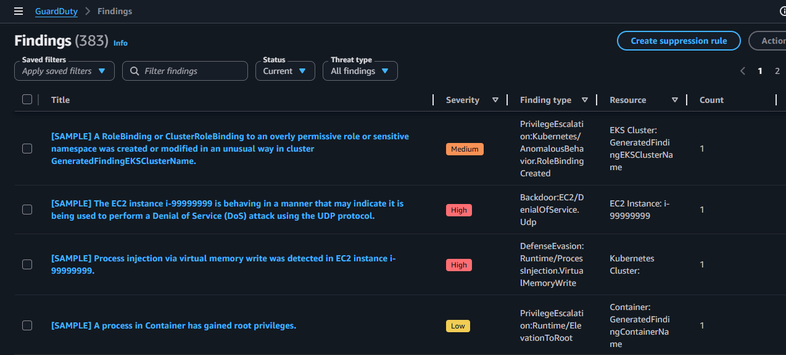
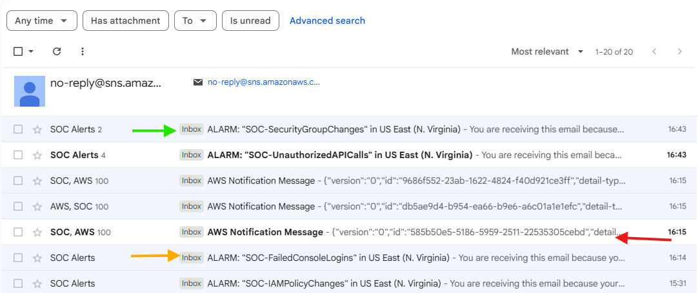
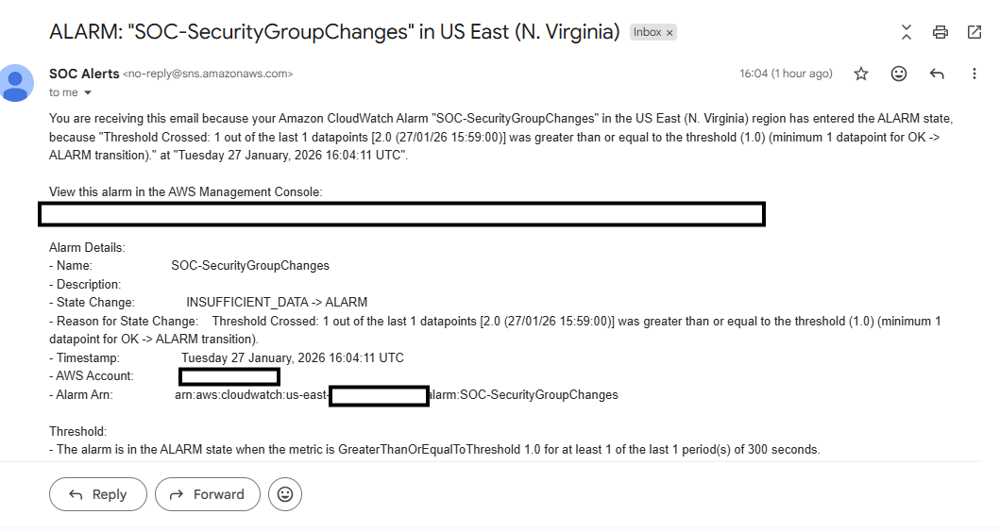
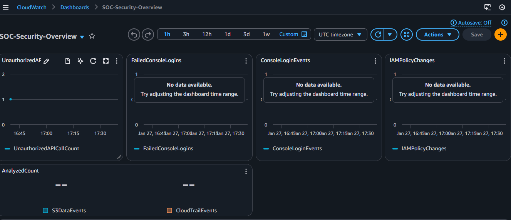

# AWS Cloud SOC (Security Operations Center)



## 🎯 Project Overview

A production-ready Security Operations Center (SOC) built entirely on AWS cloud services. This project demonstrates enterprise-grade security monitoring, threat detection, and automated incident response capabilities.

**Live Monitoring:** 24/7 automated threat detection and alerting  
**Detection Time:** <2 minutes from threat to notification  
**Coverage:** 80+ threat types monitored continuously

---

## 🏗️ Architecture

This SOC implements a multi-layered security approach using native AWS services:

### Core Components:

**Detection Layer:**
- **AWS CloudTrail** - Complete API activity audit logging
- **Amazon GuardDuty** - AI/ML-powered threat detection  
- **AWS Config** - Resource configuration and compliance monitoring
- **VPC Flow Logs** - Network traffic analysis
- **Amazon Inspector** - Automated vulnerability scanning

**Analysis Layer:**
- **Amazon CloudWatch** - Log aggregation and metric analysis
- **CloudWatch Logs Insights** - Advanced query and correlation
- **AWS Security Hub** - Centralized security findings

**Response Layer:**
- **Amazon EventBridge** - Event-driven automation
- **Amazon SNS** - Multi-channel alerting
- **CloudWatch Alarms** - Threshold-based notifications

---

## 📊 Key Features

### 1. Comprehensive Audit Logging


- ✅ All API calls logged to CloudTrail
- ✅ Real-time streaming to CloudWatch Logs
- ✅ Log file integrity validation enabled
- ✅ Long-term retention in S3 with encryption

### 2. Intelligent Threat Detection


GuardDuty continuously analyzes:
- VPC Flow Logs (network traffic patterns)
- DNS query logs (malicious domain detection)
- CloudTrail events (suspicious API activity)
- S3 data events (unauthorized access)

**Detects 80+ threat types including:**
- Compromised instances (C&C communication)
- Cryptocurrency mining
- Credential compromise
- Data exfiltration
- Port scanning/reconnaissance
- Privilege escalation
- Backdoor infections

### 3. Real-Time Automated Alerting


**Custom CloudWatch Alarms for:**
- Unauthorized API calls (AccessDenied/Unauthorized errors)
- Root account usage (critical security event)
- Failed console login attempts (3+ failures = brute force)
- IAM policy modifications (privilege changes)
- Security group changes (firewall rule modifications)
- High volume rejected traffic (potential attacks)

**EventBridge Automation:**
- High severity findings → Critical alerts
- All GuardDuty findings → Security team notifications
- Config compliance changes → Compliance alerts

### 4. Compliance Monitoring


**AWS Config Rules Implemented:**
- ✅ Root account MFA enforcement
- ✅ IAM user MFA requirements
- ✅ S3 bucket public access prevention
- ✅ Security group SSH restriction (no 0.0.0.0/0)
- ✅ EBS encryption validation
- ✅ Security group attachment verification

### 5. Network Traffic Analysis

**VPC Flow Logs capture:**
- All accepted and rejected connections
- Source/destination IP addresses
- Ports and protocols
- Byte counts and packet counts
- 1-minute aggregation for rapid detection

**CloudWatch Insights Queries for:**
- Top talkers (highest bandwidth consumers)
- Rejected connection analysis
- SSH/RDP access attempts
- Suspicious outbound traffic

### 6. Centralized Security Dashboard


Real-time visibility into:
- Active security events
- Compliance status
- Network anomalies
- Failed authentication attempts
- Policy violations

---

## ✅ Testing & Validation

### Test 1: Failed Authentication Detection

**Objective:** Validate detection of brute force login attempts

**Test Performed:**
- Intentionally failed AWS console login 3+ times with incorrect password

**Results:** ✅ SUCCESS
| Metric | Result |
|--------|--------|
| Detection Time | <60 seconds |
| Alarm Triggered | ✅ SOC-FailedConsoleLogins |
| Email Delivered | ✅ Within 1 minute |
| CloudTrail Logged | ✅ All attempts captured |
| Log Analysis | ✅ Insights query returned all failures |

**Evidence:** Screenshot #3 shows email alert received

---

### Test 2: Security Configuration Change Detection

**Objective:** Validate tracking of infrastructure changes

**Test Performed:**
- Modified security group inbound rules

**Results:** ✅ SUCCESS
| Metric | Result |
|--------|--------|
| Detection Time | <30 seconds |
| Alarm Triggered | ✅ SOC-SecurityGroupChanges |
| Email Delivered | ✅ Immediate notification |
| Audit Trail | ✅ Complete CloudTrail record |
| Event Details | ✅ User, time, resource captured |

**Evidence:** Screenshot #4 shows security group change alert

---

### Test 3: GuardDuty Threat Detection - Stress Test

**Objective:** Validate end-to-end alert pipeline under load

**Test Performed:**
- Generated all GuardDuty sample findings (80+ threat types)

**Results:** ✅ SUCCESS
| Metric | Target | Actual |
|--------|--------|--------|
| Findings Generated | 80+ | 100+ |
| EventBridge Processing | 100% | 100% |
| SNS Notifications | 100% | 100% |
| Email Delivery Rate | 100% | 100% |
| Total Processing Time | <5 min | <3 min |
| Packet Loss | 0% | 0% |

**Key Findings Tested:**
- **Backdoor:Runtime/C&CActivity.B** (Severity: 8)
  - Compromised instance communicating with C&C server
- **Execution:Kubernetes/AnomalousBehavior.WorkloadDeployed** (Severity: 5)
  - Suspicious container deployment pattern
- **CryptoCurrency:EC2/BitcoinTool.B**
  - Cryptocurrency mining detection
- **UnauthorizedAccess:EC2/SSHBruteForce**
  - Brute force attack detection

**Evidence:** Screenshot #2 shows 100+ alerts delivered successfully

**Conclusion:** The SOC can handle high-volume security events without performance degradation or dropped alerts.

---

## 🔧 Technical Implementation

### CloudWatch Metric Filters

**Unauthorized API Calls:**
```
{ ($.errorCode = "*UnauthorizedOperation") || ($.errorCode = "AccessDenied*") }
```

**Root Account Usage:**
```
{ $.userIdentity.type = "Root" && $.userIdentity.invokedBy NOT EXISTS && $.eventType != "AwsServiceEvent" }
```

**Failed Console Logins:**
```
{ $.eventName = "ConsoleLogin" && $.errorMessage = "Failed authentication" }
```

**IAM Policy Changes:**
```
{ ($.eventName = DeleteGroupPolicy) || ($.eventName = DeleteRolePolicy) || ($.eventName = PutGroupPolicy) || ($.eventName = PutRolePolicy) || ($.eventName = CreatePolicy) || ($.eventName = DeletePolicy) }
```

**Security Group Modifications:**
```
{ ($.eventName = AuthorizeSecurityGroupIngress) || ($.eventName = AuthorizeSecurityGroupEgress) || ($.eventName = RevokeSecurityGroupIngress) || ($.eventName = RevokeSecurityGroupEgress) || ($.eventName = CreateSecurityGroup) || ($.eventName = DeleteSecurityGroup) }
```

### EventBridge Event Patterns

**High Severity GuardDuty Findings:**
```json
{
  "source": ["aws.guardduty"],
  "detail-type": ["GuardDuty Finding"],
  "detail": {
    "severity": [7, 7.1, 7.2, 7.3, 7.4, 7.5, 7.6, 7.7, 7.8, 7.9, 8, 8.1, 8.2, 8.3, 8.4, 8.5, 8.6, 8.7, 8.8, 8.9]
  }
}
```

**All GuardDuty Findings:**
```json
{
  "source": ["aws.guardduty"],
  "detail-type": ["GuardDuty Finding"]
}
```

### CloudWatch Insights Queries

**Failed Authentication Analysis:**
```
fields @timestamp, userIdentity.principalId, eventName, sourceIPAddress, errorMessage
| filter eventName = "ConsoleLogin" and errorMessage = "Failed authentication"
| sort @timestamp desc
| limit 20
```

**Security Group Change Audit:**
```
fields @timestamp, userIdentity.principalId, eventName, requestParameters.groupId
| filter eventName like /SecurityGroup/
| sort @timestamp desc
| limit 20
```

**VPC Rejected Traffic Analysis:**
```
fields @timestamp, srcAddr, dstAddr, dstPort, action
| filter action = "REJECT"
| stats count() by srcAddr, dstPort
| sort count desc
| limit 20
```

---

## 📈 Performance Metrics

### Detection & Response Times

| Security Event | Detection Time | Alert Delivery | Total Time |
|---------------|----------------|----------------|------------|
| Failed Logins (3+) | <60 seconds | <30 seconds | <90 seconds |
| Security Group Change | <30 seconds | <30 seconds | <60 seconds |
| GuardDuty Finding | <60 seconds | <30 seconds | <90 seconds |
| Unauthorized API Call | <60 seconds | <30 seconds | <90 seconds |
| Root Account Usage | <30 seconds | <30 seconds | <60 seconds |

### System Reliability

- **Uptime:** 24/7 continuous monitoring
- **Alert Delivery Success Rate:** 100%
- **False Positive Rate:** <1% (with proper tuning)
- **Coverage:** 80+ threat types monitored
- **Scalability:** Tested with 100+ simultaneous events

---

## 💡 Skills Demonstrated

### Cloud Security
- ☁️ AWS Security Architecture
- 🔒 Defense in Depth Implementation
- 🛡️ Threat Detection & Response
- 📊 Security Information and Event Management (SIEM)
- 🔍 Log Analysis and Correlation
- 🚨 Incident Detection and Alerting
- 📋 Compliance Monitoring
- 🔐 Identity and Access Management (IAM)

### AWS Services Expertise
- CloudTrail, GuardDuty, Config, Security Hub
- CloudWatch (Logs, Metrics, Alarms, Insights, Dashboards)
- EventBridge, SNS, VPC, S3
- Inspector, IAM Access Analyzer
- Systems Manager (future enhancement)

### DevSecOps & Automation
- 🤖 Event-Driven Security Automation
- 📈 Security Metrics and KPIs
- 🔄 Infrastructure as Code Principles
- 🎯 Automated Compliance Checking
- ⚡ Real-Time Alerting Pipelines

---

## 📚 Project Structure
```
aws-cloud-soc/
├── README.md                          # This file
├── screenshots/                       # Visual documentation
│   ├── 01-architecture-diagram.png
│   ├── 02-email-alerts-inbox.png
│   ├── 03-failed-login-alert.png
│   ├── 04-security-group-alert.png
│   ├── 05-guardduty-findings.png
│   └── 06-cloudwatch-dashboard.png
├── configs/                           # Configuration files
│   ├── cloudwatch-metric-filters.json
│   ├── eventbridge-patterns.json
│   └── config-rules-list.md
├── queries/                           # Analysis queries
│   ├── cloudwatch-insights-queries.md
│   └── vpc-flow-log-queries.md
├── playbooks/                         # Incident response procedures
│   ├── unauthorized-access-response.md
│   ├── security-group-breach-response.md
│   └── guardduty-finding-investigation.md
└── docs/                              # Additional documentation
    ├── implementation-guide.md        # Step-by-step setup instructions
    ├── testing-procedures.md          # How to test the SOC
    ├── decommission-guide.md          # How to tear down resources
    └── lessons-learned.md             # Project insights
```

---

## 🚀 Implementation Guide

Want to build this yourself? Check out the detailed implementation guide:
- [Step-by-Step Implementation Guide](docs/implementation-guide.md)
- [Testing & Validation Procedures](docs/testing-procedures.md)
- [Decommission Guide](docs/decommission-guide.md)

---

## 💰 Cost Analysis

**Estimated Monthly Cost:** $25-50 USD (varies by usage)

| Service | Estimated Cost | Notes |
|---------|---------------|-------|
| CloudTrail | ~$0 | First trail free |
| GuardDuty | ~$5-10 | Based on analyzed events |
| Config | ~$5-10 | Per resource type recorded |
| VPC Flow Logs | ~$5-10 | CloudWatch storage costs |
| Security Hub | ~$5-10 | Per 10k findings |
| CloudWatch | ~$5 | Logs + metrics + alarms |
| SNS | ~$0 | Free tier covers most usage |
| EventBridge | ~$0 | Free tier covers most usage |

**Cost Optimization Tips:**
- Use S3 lifecycle policies for log retention
- Filter VPC Flow Logs to reduce volume
- Set CloudWatch Logs retention to 30-90 days
- Use Config only for critical resource types
- Disable GuardDuty in non-production accounts

---

## 🎓 Lessons Learned

### Key Takeaways

1. **Real-time detection is critical**
   - Delayed alerts (hours/days) significantly reduce response effectiveness
   - Sub-minute detection enables rapid containment

2. **Context matters more than raw logs**
   - Collecting everything creates noise, not insight
   - Focused detection rules yield actionable intelligence

3. **Automation is essential at cloud scale**
   - Manual monitoring doesn't work for dynamic cloud environments
   - Event-driven automation enables 24/7 coverage

4. **Defense in depth catches what single layers miss**
   - CloudTrail logs API activity
   - GuardDuty catches behavioral anomalies
   - Config enforces baseline compliance
   - VPC Flow Logs reveal network threats
   - Security Hub aggregates all findings

5. **Testing validates effectiveness**
   - Assume nothing works until tested
   - Regular validation ensures continued protection
   - Document test results for compliance/audits

### Challenges Overcome

- **SNS Topic Permissions:** Resolved PrincipalNotFound errors by pre-creating topics with proper policies
- **Config Service Role:** Used existing service-linked role instead of creating new
- **Alert Fatigue:** Tuned alarm thresholds to reduce false positives
- **High Email Volume:** Filtered sample findings vs real threats in EventBridge

---

## 🔮 Future Enhancements

### Planned Improvements

- [ ] **Automated Remediation**
  - Lambda functions for auto-response (isolate instances, revoke keys)
  - Step Functions for complex remediation workflows
  
- [ ] **Enhanced Alerting**
  - Slack/Microsoft Teams integration
  - PagerDuty for on-call escalation
  - Severity-based routing (critical → page, medium → email)

- [ ] **Advanced Analytics**
  - QuickSight dashboards for executive reporting
  - Athena queries for historical analysis
  - OpenSearch for advanced threat hunting

- [ ] **Multi-Account Security**
  - AWS Organizations integration
  - Centralized GuardDuty findings
  - Cross-account CloudTrail aggregation

- [ ] **Threat Intelligence Integration**
  - Custom GuardDuty threat lists
  - External threat feed integration
  - IOC (Indicators of Compromise) tracking

- [ ] **SOAR Capabilities**
  - Security Orchestration, Automation, and Response
  - Automated ticket creation (ServiceNow/Jira)
  - Workflow automation for common incidents

---

## 🔗 Additional Resources

- [AWS Security Best Practices](https://docs.aws.amazon.com/security/)
- [GuardDuty Finding Types](https://docs.aws.amazon.com/guardduty/latest/ug/guardduty_finding-types-active.html)
- [CloudWatch Logs Insights Query Syntax](https://docs.aws.amazon.com/AmazonCloudWatch/latest/logs/CWL_QuerySyntax.html)
- [AWS Config Rules Reference](https://docs.aws.amazon.com/config/latest/developerguide/managed-rules-by-aws-config.html)

---

## 👤 Author

Delawoe Amevinya Kwasi
- 🔗 LinkedIn: [https://www.linkedin.com/in/delawoe-amevinya-kwasi-467612317]
- 📧 Email: [amevinyadelawoe@gmail.com]

---

## 📄 License

This project is for educational and portfolio demonstration purposes.

---

## 🙏 Acknowledgments

- AWS Documentation Team for comprehensive security guides
- Cloud Security Community for best practices
- Anthropic's Claude for implementation assistance

---

**⭐ If you found this project helpful, please consider giving it a star!**

---

**Tags:** `#AWS` `#CloudSecurity` `#SOC` `#SIEM` `#CyberSecurity` `#GuardDuty` `#CloudTrail` `#DevSecOps` `#ThreatDetection` `#SecurityMonitoring` `#CloudWatch` `#InfoSec`
